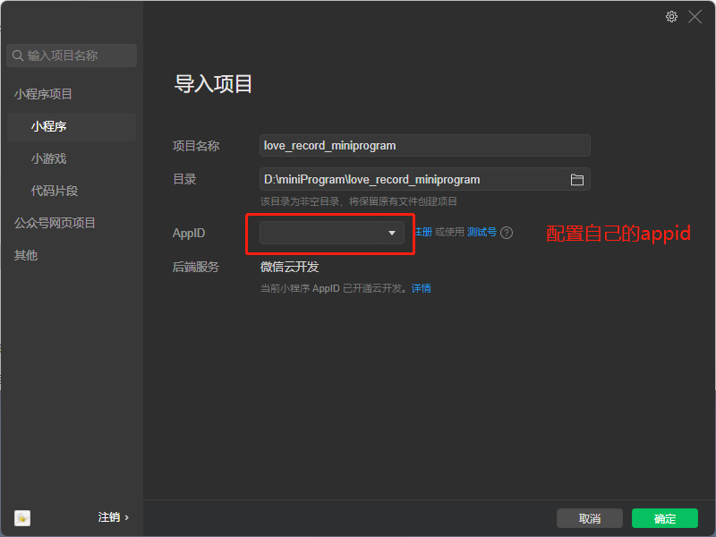
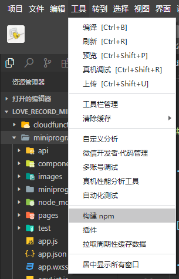
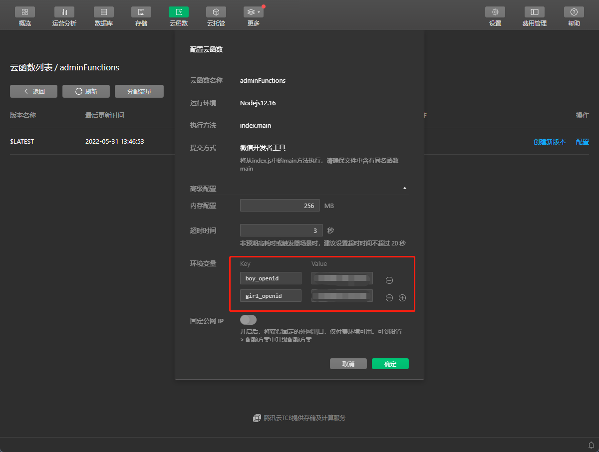
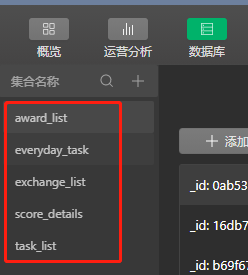
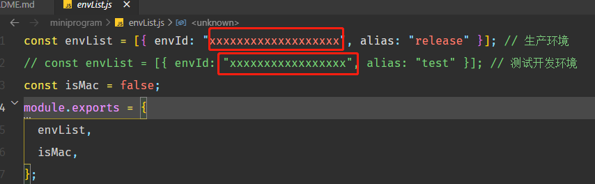

# 恋爱激励小程序

**前言**:   
因为在小红书看到了类似下图这种的小程序，咱也不能落下，淦！

<div align="center">
    <image src="https://p3-juejin.byteimg.com/tos-cn-i-k3u1fbpfcp/31bd7c280b4242439a54ddb8c967559a~tplv-k3u1fbpfcp-watermark.image?" height=500 />
</div>

当时也是啥也不考虑，直接就上手敲了，现在看着那一堆头都疼，不说了，先上效果图

<div align="center">
    <image src="./static/06.jpg" height=500 />
    <image src="./static/07.jpg" height=500 />
    <image src="./static/08.jpg" height=500 />
    <image src="./static/09.jpg" height=500 />
</div>

*注意：订阅消息已经被我删掉了，所以源代码中不会再有订阅消息那个按钮以及功能，如果有需要的话，小伙伴们可以自己搞一个☺️*

以下配置步骤应该大概可能也许不会有问题😅，如果有问题的话可以提issues啊，哈哈哈哈哈哈

目前这个小程序已经平稳运行了一个多月了，建议小程序使用体验版的就好，毕竟两个人嘛，难不成你还有第三个？！

<hr/>

## 部署

1. **导入项目**  

    下载源代码，打开微信开发者工具，新建项目，导入下载的源代码文件，配置自己的Appid


2. **安装依赖**

    - 在终端中打开`miniprogram`目录中，执行命令`npm i`，安装前端依赖；安装完成后，选择构建npm  
    
    - 安装后端依赖（只是为了方便本地调试，也可选择不安装），在终端中打开`adminFunctions`目录，执行`npm i`命令
    - 选择自己的云环境，上传云函数

3. **修改配置文件**

    - 打开云开发，开始配置已经上传的云函数，添加两个环境变量`boy_openid`、`girl_openid`，顾名思义，该环境变量是用户的openid，主要用于配置两个人的权限
  

    - 打开云开发，进入数据库，创建如下的集合：`award_list`、`everyday_task`、`exchange_list`、`score_details`、`task_list`
  

    - 打开`miniprogram/envList.js`文件，修改云开发的环境ID
  


## 功能

该小程序主要是女生完成每天的任务积攒积分，然后兑换奖励。具体的操作细节权限如下：
- Girl: 完成每日任务、新增奖励申请、审核新增任务、兑换奖励
- Boy: 新增任务申请、审核新增奖励、确认奖励已兑换
- 其他的譬如查询积分记录、任务待审核列表等等，双方都有权限查看


## 致谢

感谢JY的支持😘

## 开源
[MIT](./LICENSE)


<hr />

数据库模型

1. 任务列表 task_list

```ts
{
    _id: string,
    content: string, // 任务名称
    score: number,   // 完成可获得积分
    agree: boolean,  // 是否通过审核
    type: "task"     
}
```

2. 每日任务 everyday_task

```ts
{
    id：string,
    date: Date,  // 日期  按每天结算
    achieveTasks: Array<task_list> // 当日完成的任务
}
```

3. 积分明细 score_details

```ts
{
    id: string,
    achieveTime: Date,   // 完成时间  按完成任务结算
    details: task_list | award_list,        // 完成的任务
    nowScore: number,   // 当前积分
}
```

4. 奖励列表 award_list

```ts
{
    id: string,
    content: string,   // 奖励名称
    score: number,     // 奖励所需积分
    agree: boolean,    // 是否通过审核
    type: "award"
}
```

5. 兑换列表 exchange_list

```ts
{
    id:string,
    content: string,      // 兑换的内容
    accomplish: boolean,  // 是否已完成
}
```

